# Flutter Commentator

## Features
*  Switch Theme (Dark and Light) 
*  Localization
*  Animation With Rive 🔥
*  Persistant Storage With Hive

## Screenshots

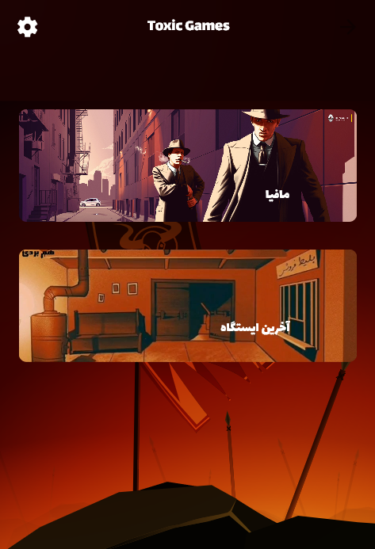
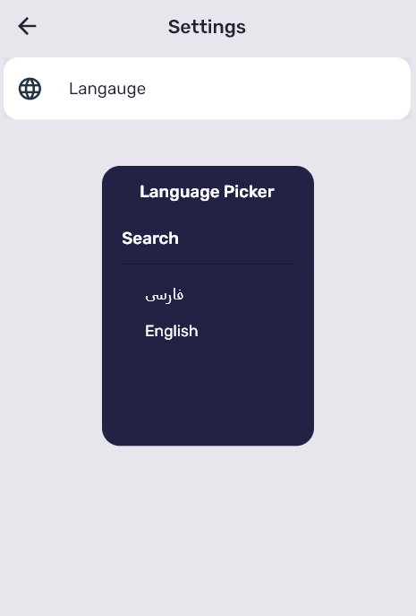
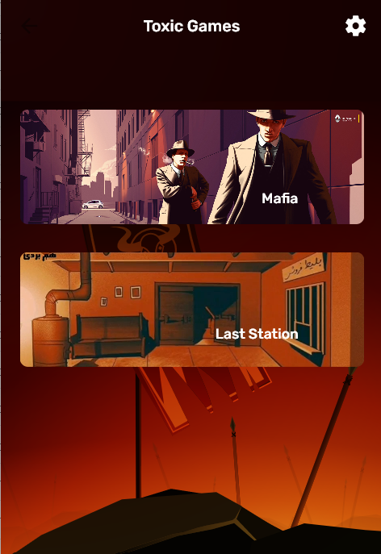
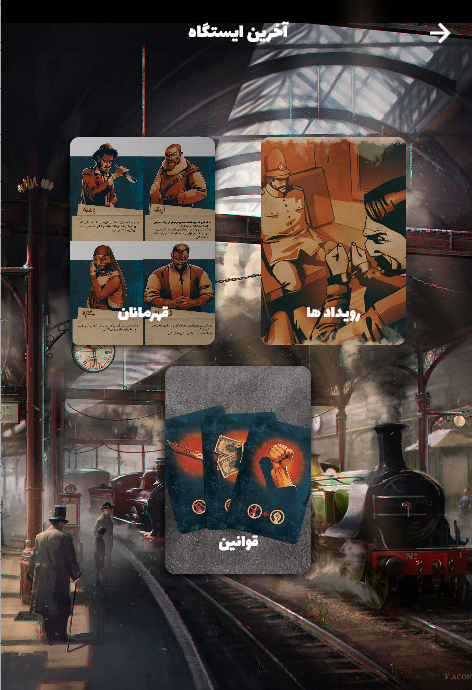     
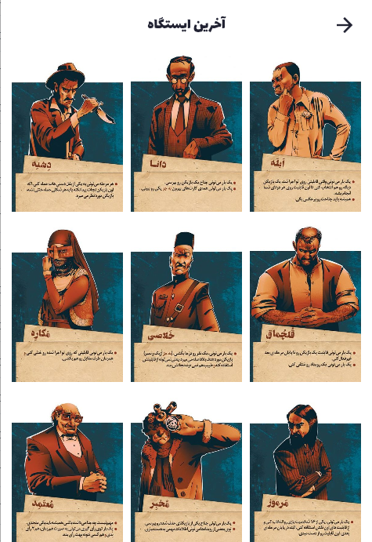     
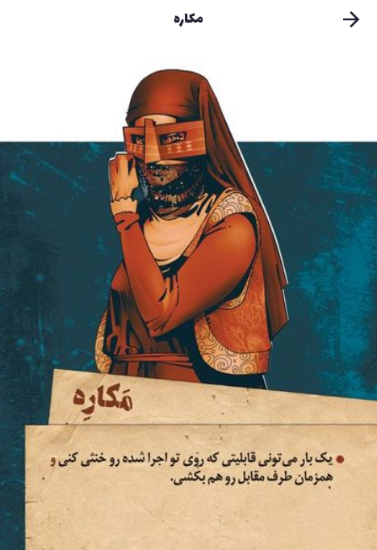     
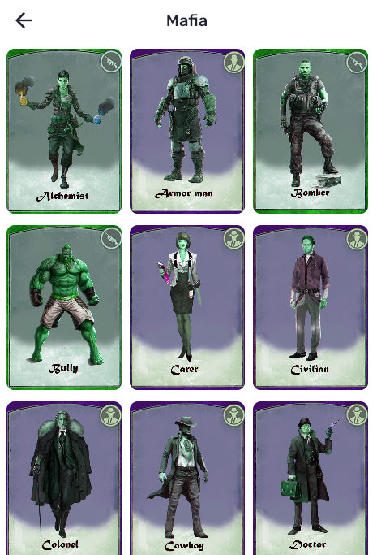
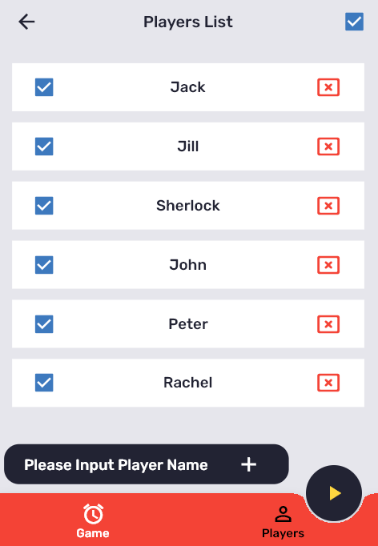
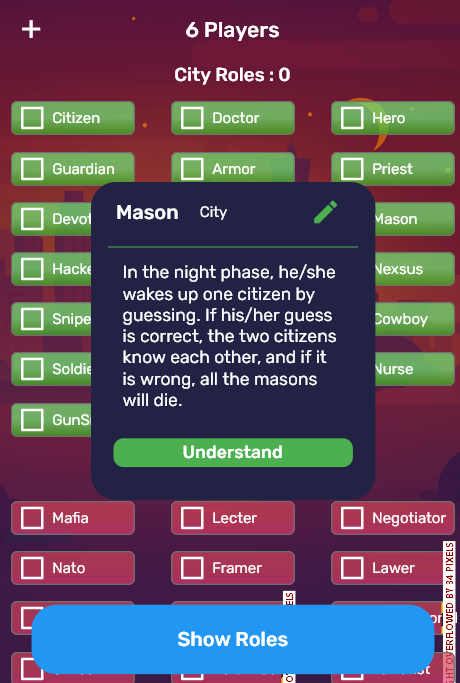
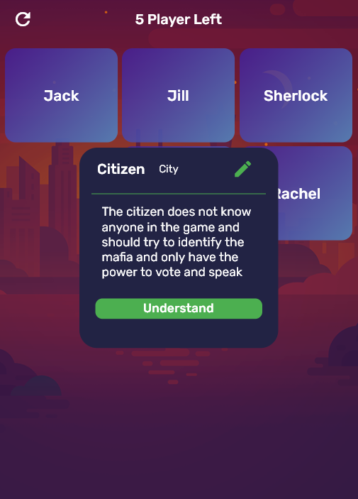
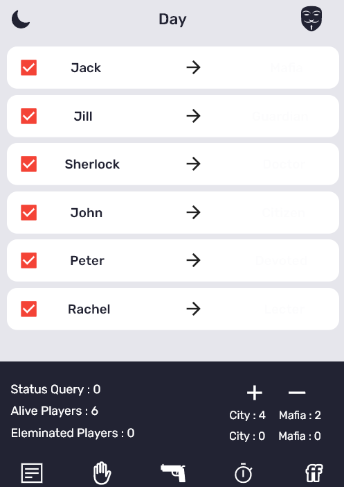
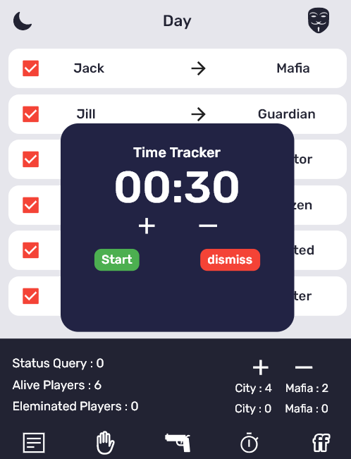

## Todo

- [ ] Complete Mafia Engine for Automatic Calculation of Role Actions
- [ ] Complete the Redesign UI
- [x] Dark Mode 
- [ ] Turn Role Page To PageView for scroll beetwen Roles 
- [ ] Add Profile 